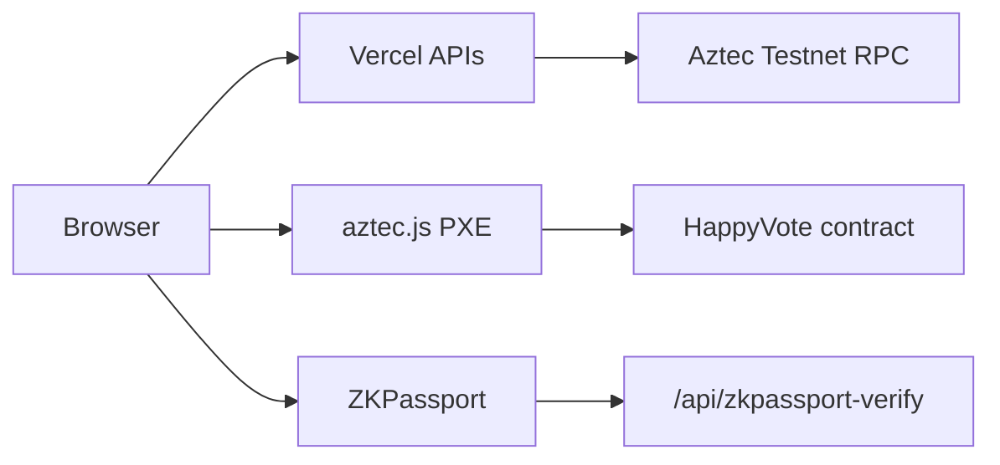

# HappyVote on Aztec

Private-by-default voting on [Aztec Network](https://aztec.network) **5.1.0**.

**Live:** https://aztec.happyvote.xyz  
**Docs:** [English](./docs/en/README.md) · [Русский](./docs/ru/README.md)

Cast a **private or open** ballot. Tallies are public (or sealed until the poll closes). Important polls can require [ZKPassport](https://zkpassport.id/) personhood without sending passport data to HappyVote.

## What this repo contains

| Path | Contents |
|------|----------|
| `src/main.nr` | `HappyVote` Aztec.nr contract (multi-poll) |
| `src/test/` | Noir tests |
| `scripts/` | Contract deploy helpers |
| `web/` | Vite + React UI and Vercel serverless APIs |
| `docs/en` · `docs/ru` | Product, architecture (Mermaid), privacy, user guide |

Related EVM HappyVote is a **separate** product. This repository is Aztec-only.

Compile and test with the **`aztec` CLI** (not `nargo` or `bb` directly). Official setup: https://docs.aztec.network/developers/getting_started

## Testnet

Contract: [`0x0aa005e43bda26d68556ea21509c907f48a689bdb9ea5355363e695d08e5eea7`](https://testnet.aztecscan.xyz/address/0x0aa005e43bda26d68556ea21509c907f48a689bdb9ea5355363e695d08e5eea7)  
RPC: `https://v5.testnet.rpc.aztec-labs.com`  
Details: [docs/en/10-TESTNET-ADDRESSES.md](./docs/en/10-TESTNET-ADDRESSES.md)

## Architecture (short)

Private vote: `SingleUseClaim` nullifier → public tally increment (address stays hidden).  
See [docs/en/02-ARCHITECTURE.md](./docs/en/02-ARCHITECTURE.md).

## License

MIT (HappyVote). Some files originate from [aztec-starter](https://github.com/AztecProtocol/aztec-starter) (Apache-2.0).

## Author

Peter Ploskikh — [X](https://x.com/pittpv) · [LinkedIn](https://www.linkedin.com/in/peter-ploskikh/) · [GitHub](https://github.com/pittpv/)
