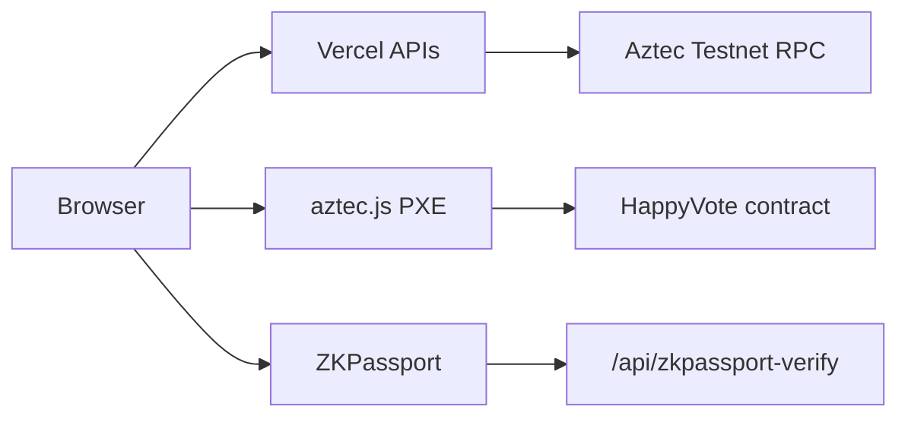

# HappyVote on Aztec

Private-by-default voting on [Aztec Network](https://aztec.network). Stable **6.0.0** is on Testnet and Mainnet. This site votes on Testnet.

**Live:** https://aztec.happyvote.xyz  
**Docs:** [English](./docs/en/README.md) · [Русский](./docs/ru/README.md)

Cast a **private or open** ballot. Tallies are public (or sealed until the poll closes). Important polls can require [ZKPassport](https://zkpassport.id/) personhood without sending passport data to HappyVote.

## What this repo contains

| Path | Contents |
|------|----------|
| `src/main.nr` | `HappyVote` Aztec.nr contract (multi-poll) |
| `hidden_author_book/` | Private-author note contract |
| `author_fee_sponsor/` | Mainnet fee payer for a private author. Not deployed |
| `src/test/` | Noir tests |
| `scripts/` | Contract deploy helpers |
| `web/` | Vite + React UI and Vercel serverless APIs |
| `docs/en` · `docs/ru` | Product, architecture (Mermaid), privacy, user guide |

Related EVM HappyVote is a **separate** product. This repository is Aztec-only.

Compile and test with the **`aztec` CLI** (not `nargo` or `bb` directly). Official setup: https://docs.aztec.network/developers/getting_started

## Testnet

HappyVote: [`0x2ee5a78e59b3f79d175d32f777ad1fbc221fffa868f7feddc707809770da00f1`](https://testnet.aztecscan.xyz/address/0x2ee5a78e59b3f79d175d32f777ad1fbc221fffa868f7feddc707809770da00f1)  
HiddenAuthorBook: [`0x2f5b5795a7f052fbde514dc1b5bd20aacd802729cc803c4bb3c3fd5ea46558de`](https://testnet.aztecscan.xyz/address/0x2f5b5795a7f052fbde514dc1b5bd20aacd802729cc803c4bb3c3fd5ea46558de)  
RPC: `https://aztec-testnet.drpc.org`  
Sponsored FPC: `0x2d8fff82a3b0c15d0a89169e7d8d043e079ab94d52031f1de1e4972ebad169d3`  
Details: [docs/en/10-TESTNET-ADDRESSES.md](./docs/en/10-TESTNET-ADDRESSES.md)

A public author is stored on the poll. A private author is a Poseidon2 commitment. The book holds the secret, and the Sponsored FPC pays that create and early end. `AuthorFeeSponsor` is the Mainnet payer and is not deployed. Ballots from the previous Testnet 6.0.0 contract [`0x08cc6d5b022900717c01af9b2800a83177aeab263cfd920416b33b56f6bc5881`](https://testnet.aztecscan.xyz/address/0x08cc6d5b022900717c01af9b2800a83177aeab263cfd920416b33b56f6bc5881) stay under **Earlier networks**. Those rows do not open `/p/:id`.

## Architecture (short)

```mermaid
flowchart LR
  Browser --> APIs["Vercel APIs"]
  Browser --> PXE["aztec.js PXE"]
  Browser --> ZKP[ZKPassport]
  APIs --> Node[Aztec Testnet RPC]
  PXE --> HV[HappyVote contract]
  ZKP --> Verify["/api/zkpassport-verify"]
```

Private vote: `SingleUseClaim` nullifier → public tally increment (address stays hidden).  
See [docs/en/02-ARCHITECTURE.md](./docs/en/02-ARCHITECTURE.md).

## License

MIT (HappyVote). Some files originate from [aztec-starter](https://github.com/AztecProtocol/aztec-starter) (Apache-2.0).

## Author

Peter Ploskikh — [X](https://x.com/pittpv) · [LinkedIn](https://www.linkedin.com/in/peter-ploskikh/) · [GitHub](https://github.com/pittpv/)
