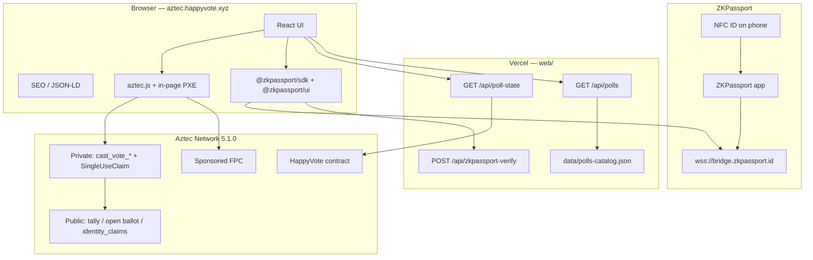
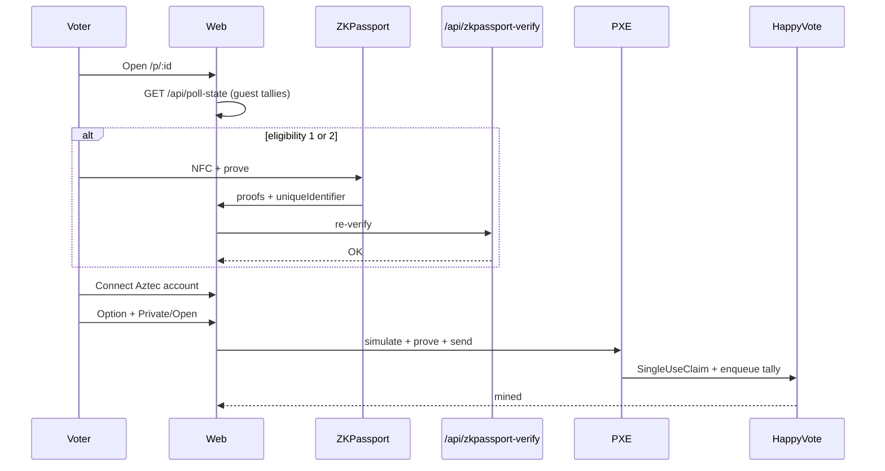

# 02 — Architecture

Live implementation is a **single** `HappyVote` contract (multi-poll maps), not a separate factory + poll instance. Off-chain catalog and guest reads sit on Vercel.

## 1. High-level



## 2. On-chain: `HappyVote` (`src/main.nr`)

Pattern: Aztec private voting — private function claims a nullifier, then enqueues a public tally update.

### 2.1 Storage

| Field | Type | Role |
|-------|------|------|
| `admin` | `PublicMutable<AztecAddress>` | Creator / `end_poll` |
| `options_count` | `Map<PollId, u32>` | 2…32; `0` = poll missing |
| `privacy_policy` | `Map<PollId, u8>` | 0 / 1 / 2 |
| `eligibility_mode` | `Map<PollId, u8>` | 0 open / 1 personhood / 2 gated |
| `metadata_hash` | `Map<PollId, Field>` | Integrity of off-chain JSON |
| `tally` | `Map<PollId, Map<Field, Field>>` | Votes per option |
| `total_votes` | `Map<PollId, Field>` | Ballot count |
| `vote_ended` | `Map<PollId, bool>` | Closed |
| `active_at_block` | `Map<PollId, PublicImmutable<u32>>` | Created at block |
| `vote_claims` | `Map<PollId, Owned<SingleUseClaim>>` | One vote per account per poll |
| `open_ballots` | `Map<PollId, Map<AztecAddress, Field>>` | `option_id + 1` (0 = none) |
| `identity_claims` | `Map<PollId, Map<Field, bool>>` | One ZKPassport UID per poll |
| `sealed` | `Map<PollId, bool>` | Hide tallies until ended |

`PollId` is a struct `{ id: Field }` in Noir and `{ id: Fr }` in TypeScript.

### 2.2 External functions

| Method | Visibility | Purpose |
|--------|------------|---------|
| `constructor(admin)` | public initializer | Non-zero admin |
| `create_poll(poll_id, options_count, privacy_policy, eligibility_mode, metadata_hash, sealed)` | public | Contract admin only (Iteration 1 operators) |
| `cast_vote_private(poll_id, option_id, identity_commitment)` | private → enqueue public | Hidden address; public tally++ |
| `cast_vote_open(poll_id, option_id, identity_commitment)` | private → enqueue public | Public ballot + tally++ |
| `end_poll(poll_id)` | public | Admin close |
| `get_tally` / `get_total_votes` | view | `0` if sealed and not ended |
| `get_options_count` / `get_privacy_policy` / `get_eligibility_mode` / `get_metadata_hash` / `get_vote_ended` / `get_sealed` / `get_admin` | view | Config |
| `get_open_ballot(poll_id, voter)` | view | Open receipt |
| `has_identity_voted(poll_id, identity_commitment)` | view | ZKPassport reuse |

`identity_commitment`: `0` on open polls; Poseidon/Field hash of ZKPassport `uniqueIdentifier` otherwise.

### 2.3 Vote flow



### 2.4 Hashing

Application hashes in Aztec.nr use **Poseidon2**. Catalog `metadata_hash` uses SHA-256 → Field (`fromBufferReduce`) so the browser and catalog publisher share one digest.

### 2.5 Safety checks

- `option_id` must equal `option_id as u32 as Field` (reject truncation).
- Open eligibility forbids non-zero identity; personhood/gated require non-zero and unused claim.
- Private and open votes share the same `SingleUseClaim` domain.

## 3. Off-chain

### 3.1 Frontend (`web/`)

Vite + React. Routes:

| Path | Page |
|------|------|
| `/` | Catalog + mission |
| `/p/:id` | Vote |
| `/legal/:slug` | Terms, Privacy, Data Safety, Cookies, GDPR |

Guest tallies: same-origin `/api/poll-state` only (public Testnet RPC rate-limits browsers).

### 3.2 APIs

| Endpoint | Role |
|----------|------|
| `GET /api/poll-state?pollId=&optionsCount=` | Guest public tallies (cached) |
| `GET /api/polls` | Shared poll catalog |
| `POST /api/zkpassport-verify` | Server re-verify `@zkpassport/sdk` |

### 3.3 Catalog schema

```json
{
  "id": "3",
  "title": "…",
  "description": "…",
  "options": [{ "label": "…", "description": "…" }],
  "eligibilityMode": 1,
  "privacyPolicy": 2,
  "sealed": false,
  "zkRequirements": {
    "personhood": true,
    "minAge": null,
    "nationalityIn": [],
    "nationalityOut": [],
    "sanctions": false,
    "facematchStrict": false,
    "policyId": null,
    "purpose": "Prove eligibility to vote on HappyVote on Aztec"
  }
}
```

## 4. Accounts and fees

| Env | Accounts | Fees |
|-----|----------|------|
| Local network | Script-deployed Schnorr | Free |
| Testnet | Browser session | Sponsored FPC |
| Alpha | Production accounts | Fee Juice / FPC |

## 5. Repository layout (this Aztec project)

```
happy-vote-aztec/
├── AGENTS.md
├── Nargo.toml                 # contract package happy_vote_aztec
├── src/main.nr                # HappyVote
├── src/test/                  # Noir tests (24)
├── scripts/                   # deploy helpers
├── config/                    # local-network + testnet
├── web/                       # Vite app + Vercel api/
└── docs/                      # en/ + ru/
```

In the combined HappyVote monorepo the same tree lives under `aztec/` with product docs in `docs/aztec/`.

## 6. Trust boundaries

| Data | Trust |
|------|-------|
| Private ballot address | Client + ZK proof |
| Live option tally | Public Aztec state (unless sealed) |
| ZKPassport attributes | Device proof; HappyVote re-verifies proofs, does not see the passport |
| Off-chain title/options | Operators + catalog; `metadata_hash` on-chain |
| Operator keys | Operator secret (gitignored `.env`) |
| Site analytics | None — no third-party counter; host may log requests |

## 7. Relation to EVM HappyVote

Separate subdomain and stack. Shared brand and Happy/Sad template only. No shared ABI, no vote migration.
