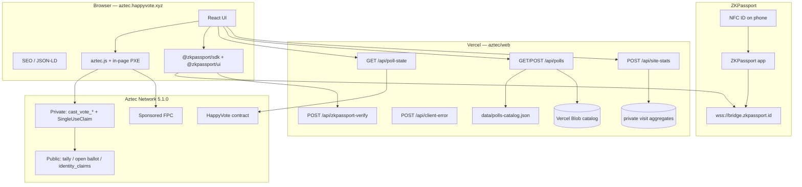
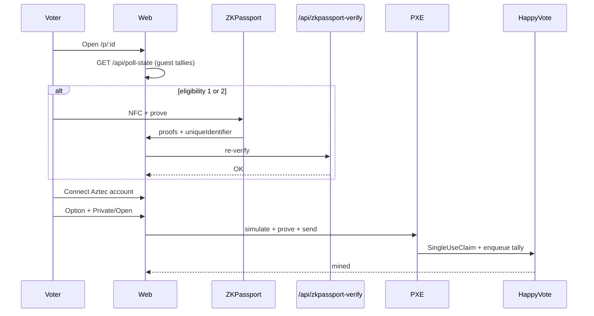

# 02 — Architecture

Live implementation is a **single** `HappyVote` contract (multi-poll maps), not a separate factory + poll instance. Off-chain catalog and guest reads sit on Vercel.

## 1. High-level



## 2. On-chain: `HappyVote` (`src/main.nr`)

Pattern: Aztec private voting — private function claims a nullifier, then enqueues a public tally update.

### 2.1 Storage

| Field | Type | Role |
|-------|------|------|
| `admin` | `PublicMutable<AztecAddress>` | `create_poll` / `end_poll` / `cancel_poll` / pause / transfer |
| `options_count` | `Map<PollId, PublicImmutable<u32>>` | 2…32; uninitialized = poll missing |
| `privacy_policy` | `Map<PollId, PublicImmutable<u8>>` | 0 / 1 / 2 |
| `eligibility_mode` | `Map<PollId, PublicImmutable<u8>>` | 0 open / 1 personhood / 2 gated |
| `metadata_hash` | `Map<PollId, PublicImmutable<Field>>` | Integrity of off-chain JSON |
| `tally` | `Map<PollId, Map<Field, Field>>` | Votes per option |
| `total_votes` | `Map<PollId, Field>` | Ballot count |
| `vote_ended` | `Map<PollId, bool>` | Admin close |
| `active_at_block` | `Map<PollId, PublicImmutable<u32>>` | Created at block |
| `vote_claims` | `Map<Field, Owned<SingleUseClaim>>` | Packed `(poll, period)` → account claim |
| `open_ballots` | `Map<PollId, Map<AztecAddress, Field>>` | `option_id + 1` (0 = none); latest open choice |
| `identity_claims` | `Map<Field, bool>` | Poseidon2(`poll`, `period`, ZKPassport UID) |
| `sealed` | `Map<PollId, PublicImmutable<u8>>` | Slot 13 flags: bit0 hide tallies until closed · bit1 UTC-day frequency |
| `starts_at` | `Map<PollId, PublicImmutable<u64>>` | Unix seconds; `0` = unset |
| `ends_at` | `Map<PollId, PublicImmutable<u64>>` | Unix seconds; `0` = unset |
| `cancelled` | `Map<PollId, bool>` | Cancelled (no votes) |
| `next_poll_id` | `PublicMutable<u64>` | Auto-assign when `poll_id.id == 0` |
| `paused` | `PublicMutable<bool>` | Blocks create + vote |

`PollId` is a struct `{ id: Field }` in Noir and `{ id: Fr }` in TypeScript.

### 2.2 External functions

| Method | Visibility | Purpose |
|--------|------------|---------|
| `constructor(admin)` | public initializer | Non-zero admin; `next_poll_id = 1` |
| `create_poll(..., sealed, starts_at, ends_at, vote_frequency)` | public | Contract admin; returns assigned id (`0` = next) |
| `cast_vote_private(poll_id, option_id, identity_commitment, vote_period)` | private → enqueue public | Hidden address; public tally++ |
| `cast_vote_open(poll_id, option_id, identity_commitment, vote_period)` | private → enqueue public | Public ballot + tally++ |
| `end_poll(poll_id)` | public | Admin close |
| `cancel_poll(poll_id)` | public | Admin; only if `total_votes == 0` |
| `transfer_admin(new_admin)` | public | Non-zero successor |
| `set_paused(paused)` | public | Pause create + vote |
| `get_tally` / `get_total_votes` | view | `0` if sealed and not closed |
| `is_voting_open` | view | Exists, not paused, not closed, started |
| Config views | view | options, policy, eligibility, metadata, sealed, starts/ends, cancelled, paused, next id, admin, vote frequency / current period |
| `get_open_ballot(poll_id, voter)` | view | Open receipt |
| `has_identity_voted(poll_id, identity_commitment)` | view | ZKPassport reuse |

`identity_commitment`: `0` on open polls; Poseidon/Field hash of ZKPassport `uniqueIdentifier` otherwise.

### 2.3 Vote flow



### 2.4 Hashing

Application hashes in Aztec.nr use **Poseidon2**. Catalog `metadata_hash` uses SHA-256 → Field (`fromBufferReduce`) so the browser and catalog publisher share one digest.

### 2.5 Safety checks

- `option_id` must equal `option_id as u32 as Field` (reject truncation). Invalid option and privacy/eligibility mismatches are checked in **private** (PublicImmutable config) **before** `SingleUseClaim`.
- Open eligibility forbids non-zero identity; personhood/gated require non-zero and unused claim.
- Private and open votes share the same `SingleUseClaim` domain (and the same UTC-day period when `vote_frequency = 1`).
- Public vote path also checks pause, existence, `starts_at` / `ends_at`, `poll_is_closed`, and `vote_period == timestamp / 86400` on daily polls.
- Private votes with `ends_at != 0` or a daily period set `expiration_timestamp` so a late inclusion cannot burn the nullifier after the window.
- `starts_at` cannot be fully enforced in private (no inclusion time). The public kernel rejects early votes; do not submit a ballot before start.

Honest limits: `identity_commitment` is supplied by the caller (ZKPassport is re-verified off-chain). Sealed is view-hiding, not MPC — raw public storage of tallies remains readable. `option_id` is public in the enqueue. Pause/`end_poll` after a private proof can still consume the nullifier (those flags are `PublicMutable`).

## 3. Off-chain

### 3.1 Frontend (`web/`)

Vite + React. Routes:

| Path | Page |
|------|------|
| `/` | Catalog + mission |
| `/p/:id` | Vote |
| `/legal/:slug` | Terms, Privacy, Data Safety, Cookies, GDPR |

Guest tallies: same-origin `/api/poll-state` only (public Testnet RPC rate-limits browsers).

### 3.2 APIs

| Endpoint | Role |
|----------|------|
| `GET /api/poll-state?pollId=&optionsCount=` | Batch `node_getPublicStorageAt`, ~15s cache |
| `GET /api/polls` | Seed JSON + optional Blob overlay (`showOnHome` / `homeRank` for `/`) |
| `POST /api/polls` | Authenticated catalog publish (operator-only) |
| `POST /api/zkpassport-verify` | Server re-verify `@zkpassport/sdk` |
| `POST /api/client-error` | Boot / vote errors → Vercel logs |
| `POST /api/site-stats` | Cookieless pageview ingest; daily aggregates only (no IP, no poll id) |
| `GET /api/site-stats` | Operator-only aggregated visit stats |

### 3.3 Catalog schema (seed / Blob)

```json
{
  "id": "3",
  "title": "…",
  "description": "…",
  "options": [{ "label": "…", "description": "…" }],
  "eligibilityMode": 1,
  "privacyPolicy": 2,
  "sealed": false,
  "startsAt": null,
  "endsAt": null,
  "zkRequirements": {
    "personhood": true,
    "minAge": null,
    "nationalityIn": [],
    "nationalityOut": [],
    "sanctions": false,
    "facematchStrict": false,
    "policyId": null,
    "purpose": "Prove eligibility to vote on HappyVote on Aztec"
  }
}
```

## 4. Accounts and fees

| Env | Accounts | Fees |
|-----|----------|------|
| Local network | Script-deployed Schnorr | Free |
| Testnet | Browser session | Sponsored FPC |
| Alpha | Production accounts | Fee Juice / FPC |

## 5. Repository layout (this Aztec project)

```
happy-vote-aztec/
├── AGENTS.md
├── Nargo.toml                 # contract package happy_vote_aztec
├── src/main.nr                # HappyVote
├── src/test/                  # Noir tests (48)
├── scripts/                   # deploy, smoke, create_poll
├── config/                    # local-network + testnet
├── web/                       # Vite app + Vercel api/
└── docs/                      # en/ + ru/
```

In the combined HappyVote monorepo the same tree lives under `aztec/` with product docs in `docs/aztec/`.

## 6. Trust boundaries

| Data | Trust |
|------|-------|
| Private ballot address | Client + ZK proof |
| Live option tally | Public Aztec state (unless sealed) |
| ZKPassport attributes | Device proof; HappyVote re-verifies proofs, does not see the passport |
| Off-chain title/options | Operators + catalog; `metadata_hash` on-chain |
| Operator keys | Operator secret (gitignored `.env`) |
| Site analytics | First-party daily aggregates (no cookies, no stored IP); no third-party counter |

## 7. Relation to EVM HappyVote

Separate subdomain and stack. Shared brand and Happy/Sad template only. No shared ABI, no vote migration.
