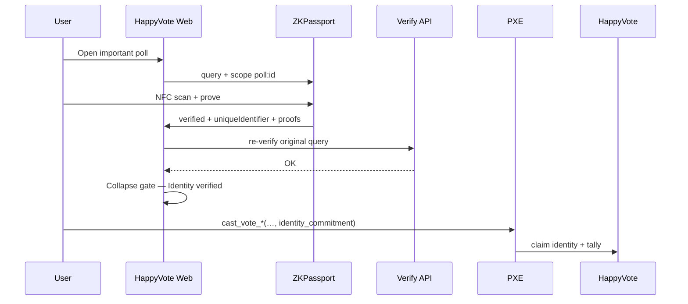

# 04 — ZKPassport

Official: https://zkpassport.id/ · Docs: https://docs.zkpassport.id/  
Domain: `aztec.happyvote.xyz`

## 1. Why

For important polls:

- person vs bot / account farm;
- optional age / nationality / sanctions;
- **no** passport files on HappyVote servers.

Flow: NFC ID → proof on phone → HappyVote gets predicates result + `uniqueIdentifier`.

## 2. Integration modes

| Mode | When | Query source |
|------|------|----------------|
| Self-served SDK | Per-poll rules | `@zkpassport/sdk` / `@zkpassport/ui` |
| Dashboard policy | Stable branded flow | [dashboard.zkpassport.id](https://dashboard.zkpassport.id) |

Production: SDK + QR (`ZKPassportQRCode`), domain registered, default Dashboard policy id `vote-identity-verification` (RU elections template) when `policyId` is set for important polls.

## 3. Query examples

Personhood only:

```tsx
<ZKPassportQRCode
  name="HappyVote on Aztec"
  purpose="Prove you are a unique person to vote"
  scope={`poll:${pollId}`}
  query={(q) => q.done()}
  onResult={async ({ verified, uniqueIdentifier, proofs }) => {
    if (!verified) throw new Error("ZKPassport verification failed");
    // POST /api/zkpassport-verify then hash uniqueIdentifier
  }}
/>
```

Gated example: `q.gte("age", 18).eq("nationality", "RUS")` — only fields the poll needs.

## 4. Bind to the Aztec vote



On-chain: `identity_commitment ≠ 0` for eligibility 1/2; `identity_claims` rejects reuse.

## 5. Domain rules

1. Register `aztec.happyvote.xyz` in the ZKPassport Dashboard.
2. `uniqueIdentifier` is scoped to domain (+ query scope). Changing domain changes IDs.
3. Do not log proofs with PII.

## 6. Dev Mode

`VITE_ZKPASSPORT_DEV_MODE=true` for mock passports. Turn **off** for real ID proofs.

Keep server re-verify enabled in production. Mock unlock is **DEV only**.

## 7. Product limits

- Several IDs per person → “one ID ↔ one vote”, not perfect uniqueness.
- Stronger personhood: FaceMatch `strict` + salted unique identifier (ZKPassport docs).
- User needs the ZKPassport app.

## 8. When to require it

| Poll type | Default eligibility |
|-----------|---------------------|
| Fun / Happy/Sad | Open |
| Community governance | Personhood recommended |
| Political / “election-style” | Personhood required (+ optional gates) |
| User-created (iter 2) | Creator chooses; platform may force above a threshold |

## 9. Off-chain requirements JSON

Stored in catalog / `localStorage`; SHA-256 → `metadata_hash`.

```json
{
  "personhood": true,
  "minAge": 18,
  "nationalityIn": ["USA", "DEU"],
  "nationalityOut": [],
  "sanctions": false,
  "facematchStrict": false,
  "policyId": null,
  "purpose": "Prove eligibility to vote on HappyVote on Aztec"
}
```

`eligibility_mode`: `1` personhood-only · `2` if age / nationality / sanctions / FaceMatch / `policyId` is set.

## 10. UI (2026-08-13)

The QR widget is drop-in `@zkpassport/ui`. HappyVote wraps it in portal chrome (teal / amber / Sora). SDK `display` hides the duplicate widget title.

After success:

- QR is removed (bridge no longer needed);
- compact **Identity verified** banner;
- details (checks + personhood id) expand on click.

## 11. Checklist

- [x] `@zkpassport/sdk` + `@zkpassport/ui` (`VITE_ZKPASSPORT_ENABLED=true`)
- [x] Domain in Dashboard
- [x] Gate + requirement list
- [x] Per-poll ZKPassport requirements at create
- [x] On-chain `eligibility_mode` + `metadata_hash`
- [x] `/api/zkpassport-verify`
- [x] `identity_commitment` + `identity_claims`
- [x] Portal-styled gate + collapse on success
- [x] Noir: same identity, two accounts fails
- [ ] Real-device E2E on Testnet
- [ ] Disable Dev Mode
