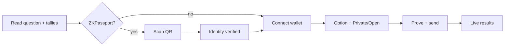

# 12 — UI / UX

Production: **https://aztec.happyvote.xyz**  
Brand: **HappyVote on Aztec**  
Code: `web/`

## Summary

Landing explains *why* the portal exists (privacy + verified personhood + safer participation). Vote pages match home width and separate **casting a ballot** from **reading live results**.

## Home (`/`)

Landing: brand, mission, pillars, **featured polls** (catalog `showOnHome`), trust, footer. The full catalog is **All polls** (`/polls`) — search, topic / country / eligibility filters.

Header (desktop and mobile): logo, desktop nav shortcuts, hamburger menu with Home / All polls, wallet connect or connected address, and a slot for later language / theme.

### Content blocks

1. **Independent voting, without exposing who you are**
2. Pillars: Private by design · Verified, not doxed (ZKPassport) · Safer where votes are risky
3. **Featured polls** — operator-selected cards, then a link to the full catalog
4. **Why this matters** — independent of local gatekeepers; honest public tallies with protected voters

Author in the footer: Peter Ploskikh — [X](https://x.com/pittpv), [LinkedIn](https://www.linkedin.com/in/peter-ploskikh/), [GitHub](https://github.com/pittpv/).

## All polls (`/polls`)

Same card grid as home, with search and filters. Use this when the catalog grows beyond a short featured list.

## Vote (`/p/:id`)

| Before | After |
|--------|--------|
| max 720px | `.app.app-wide` max **1080px** |
| Compact brand mark in the page | Site header + **← All polls** back to `/polls`; poll title as `h1` |
| Single stack | Ballot column + live-results column (≥860px) |
| Fees + how-to always visible | Collapsed `
` |
| No step hint | Ready/Verify → Connect → Vote |

### Interaction

1. Guest: question, options, public tallies (`/api/poll-state`), plus schedule/countdown when dates are set. If the contract is paused or the poll is cancelled, Connect and Vote stay locked. Daily polls show a **Daily** catalog badge and a UTC-day countdown after a ballot.
2. Optional ZKPassport gate (only while the voting window is open).
3. Connect Aztec wallet (prefer Browser session).
4. Option + Private/Open → submit.
5. Status + explorer link next to the CTA.

## ZKPassport gate

Portal chrome (teal / amber / Sora) wraps `@zkpassport/ui`. Duplicate widget title is hidden. After success:

- QR is removed;
- compact **Identity verified** banner;
- details expand on click.

Desktop layout avoids large empty regions and awkward wrapping around the QR card. On small screens the connect CTA is not a huge sticky overlay that covers the ballot.

## Ballot privacy spacing

The **Ballot privacy** heading and the Private / Open controls have a clear gap so the fieldset does not look cramped.

## Schedule

Poll cards and vote pages show **Upcoming / Live / Ended** when `startsAt` / `endsAt` are set (catalog ISO; vote page prefers on-chain unix seconds). Before start: countdown, Connect and Vote locked. After start: countdown to the end. Omit both dates for an always-open poll until `end_poll` or `cancel_poll`. On-chain pause also locks voting while guests can still read the question.

## Legal

Footer links on catalog, vote, and legal pages:

| Document | Path |
|----------|------|
| Terms of Service | `/legal/terms` |
| Privacy Policy | `/legal/privacy` |
| Data Safety | `/legal/data-safety` |
| Cookie Policy | `/legal/cookies` |
| GDPR | `/legal/gdpr` |

Effective date: **15 August 2026**. Contact: **legal@happyvote.xyz**. See [13-LEGAL.md](./13-LEGAL.md).

## SEO

Per-route `document.title`, meta description, canonical, Open Graph, Twitter card, JSON-LD (`Organization`, `Person`, `WebSite`, `WebApplication`, `WebPage`). `robots.txt` allows indexing of public pages. `sitemap.xml` lists home, **All polls** `/polls`, demo polls `/p/1` `/p/2` `/p/3`, and legal URLs.

No third-party analytics counter on this subdomain. First-party cookieless daily aggregates only (`POST /api/site-stats`).

## Shipped 2026-08-13

- Sticky primary CTA on small screens (does not cover the ballot as a full-width wallet wall)
- Progress bars inside option buttons
- ZKPassport server re-verify + on-chain `identity_commitment`
- Portal-styled gate + collapse on success
- Brand rename to HappyVote on Aztec
- SEO

## Backlog (not shipped)

- Toast-style status instead of inline text
- Explicit confirm strip before Vote
- Empty-results CTA (“Be the first vote”)
- UI i18n RU/EN
