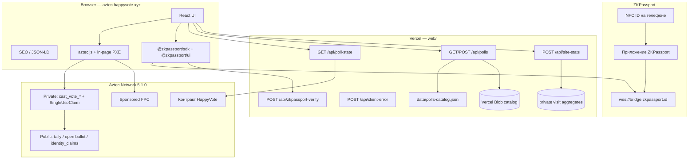
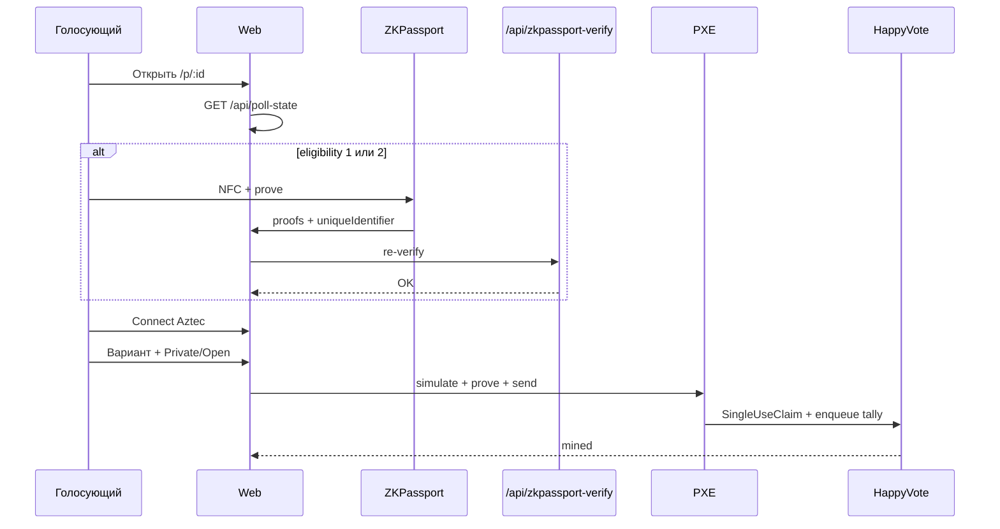

# 02 — Архитектура

Реализация — **один** контракт `HappyVote` (multi-poll maps), не отдельная factory. Off-chain каталог и гостевые чтения — на Vercel.

## 1. Высокий уровень



## 2. On-chain: `HappyVote` (`src/main.nr`)

Паттерн Aztec private voting: private function берёт nullifier, затем enqueue публичного обновления tally.

### 2.1 Storage

| Поле | Тип | Роль |
|------|-----|------|
| `admin` | `PublicMutable<AztecAddress>` | `create_poll` / `end_poll` / `cancel_poll` / pause / transfer |
| `options_count` | `Map<PollId, PublicImmutable<u32>>` | 2…32; не инициализирован = опроса нет |
| `privacy_policy` | `Map<PollId, PublicImmutable<u8>>` | 0 / 1 / 2 |
| `eligibility_mode` | `Map<PollId, PublicImmutable<u8>>` | 0 open / 1 personhood / 2 gated |
| `metadata_hash` | `Map<PollId, PublicImmutable<Field>>` | Целостность off-chain JSON |
| `tally` | `Map<PollId, Map<Field, Field>>` | Голоса по вариантам |
| `total_votes` | `Map<PollId, Field>` | Число бюллетеней |
| `vote_ended` | `Map<PollId, bool>` | Закрытие admin |
| `active_at_block` | `Map<PollId, PublicImmutable<u32>>` | Блок создания |
| `vote_claims` | `Map<Field, Owned<SingleUseClaim>>` | Упакованный `(poll, period)` → аккаунт |
| `open_ballots` | `Map<PollId, Map<AztecAddress, Field>>` | `option_id + 1` (0 = нет); последний open-выбор |
| `identity_claims` | `Map<Field, bool>` | Poseidon2(`poll`, `period`, ZKPassport UID) |
| `sealed` | `Map<PollId, PublicImmutable<u8>>` | Слот 13: bit0 скрыть tallies · bit1 сутки UTC |
| `starts_at` | `Map<PollId, PublicImmutable<u64>>` | Unix-секунды; `0` = не задано |
| `ends_at` | `Map<PollId, PublicImmutable<u64>>` | Unix-секунды; `0` = не задано |
| `cancelled` | `Map<PollId, bool>` | Отмена (без голосов) |
| `next_poll_id` | `PublicMutable<u64>` | Авто-id при `poll_id.id == 0` |
| `paused` | `PublicMutable<bool>` | Блокирует create + vote |

`PollId`: `{ id: Field }` в Noir, `{ id: Fr }` в TypeScript.

### 2.2 Внешние функции

| Метод | Видимость | Назначение |
|-------|-----------|------------|
| `constructor(admin)` | public initializer | Ненулевой admin; `next_poll_id = 1` |
| `create_poll(..., sealed, starts_at, ends_at, vote_frequency)` | public | Контрактный admin; возвращает id (`0` = следующий) |
| `cast_vote_private(..., vote_period)` | private → enqueue public | Адрес скрыт; публичный tally++ |
| `cast_vote_open(..., vote_period)` | private → enqueue public | Публичный бюллетень + tally++ |
| `end_poll(poll_id)` | public | Закрытие (контрактный admin) |
| `cancel_poll(poll_id)` | public | Отмена, только если `total_votes == 0` |
| `transfer_admin` / `set_paused` | public | Смена admin / пауза |
| `get_tally` / `get_total_votes` | view | `0` если sealed и не закрыт |
| `is_voting_open` | view | Существует, не на паузе, не закрыт, стартовал |
| Прочие view | view | Конфиг, окно, cancel, pause, open ballot, identity claim |

`identity_commitment`: `0` на open-опросах; иначе Field от ZKPassport `uniqueIdentifier`.

### 2.3 Поток голоса



### 2.4 Хеширование

В Aztec.nr — **Poseidon2**. `metadata_hash` каталога: SHA-256 → Field (`fromBufferReduce`).

### 2.5 Проверки

- `option_id` равен `option_id as u32 as Field` (отсечь truncation). Неверный option / privacy / eligibility проверяются **в private** (PublicImmutable) **до** `SingleUseClaim`.
- Open eligibility запрещает ненулевой identity; personhood/gated требуют его и свободный claim.
- Private и open делят один домен `SingleUseClaim`.
- Публичный путь проверяет паузу, существование, `starts_at` / `ends_at` и закрытие.
- При `ends_at != 0` private ставит `expiration_timestamp = ends_at - 1`, чтобы поздняя inclusion не сожгла nullifier.
- `starts_at` в private полностью не проверить (нет времени включения). Публичный kernel отклоняет ранние голоса; не отправляйте бюллетень до старта.

Честные ограничения: `identity_commitment` задаёт вызывающий (ZKPassport перепроверяется off-chain). Sealed — скрытие view, не MPC. `option_id` публичен в enqueue. Pause/`end_poll` после private proof могут всё равно потратить nullifier (`PublicMutable`).

## 3. Off-chain

### 3.1 Фронтенд (`web/`)

Vite + React. Маршруты:

| Путь | Страница |
|------|----------|
| `/` | Каталог + миссия |
| `/p/:id` | Голосование |
| `/legal/:slug` | Terms, Privacy, Data Safety, Cookies, GDPR |

Гостевые tallies только через same-origin `/api/poll-state`.

### 3.2 API

| Endpoint | Роль |
|----------|------|
| `GET /api/poll-state` | Batch `node_getPublicStorageAt`, кэш ~15с |
| `GET /api/polls` | Seed JSON + опциональный Blob (`showOnHome` / `homeRank` для `/`) |
| `POST /api/polls` | Публикация метаданных каталога (только оператор) |
| `POST /api/zkpassport-verify` | Server re-verify |
| `POST /api/client-error` | Ошибки в логи Vercel |
| `POST /api/site-stats` | Cookieless ingest просмотров; только дневные агрегаты |
| `GET /api/site-stats` | Агрегаты посещений (только оператор) |

### 3.3 Схема каталога

```json
{
  "id": "3",
  "title": "…",
  "description": "…",
  "options": [{ "label": "…", "description": "…" }],
  "eligibilityMode": 1,
  "privacyPolicy": 2,
  "sealed": false,
  "startsAt": null,
  "endsAt": null,
  "zkRequirements": {
    "personhood": true,
    "minAge": null,
    "nationalityIn": [],
    "nationalityOut": [],
    "sanctions": false,
    "facematchStrict": false,
    "policyId": null,
    "purpose": "Prove eligibility to vote on HappyVote on Aztec"
  }
}
```

## 4. Аккаунты и комиссии

| Среда | Аккаунты | Fees |
|-------|----------|------|
| Local network | Schnorr из скриптов | Бесплатно |
| Testnet | Browser session | Sponsored FPC |
| Alpha | Production | Fee Juice / FPC |

## 5. Структура репозитория

```
happy-vote-aztec/
├── AGENTS.md
├── Nargo.toml
├── src/main.nr
├── src/test/
├── scripts/
├── config/
├── web/
└── docs/                      # en/ + ru/
```

В монорепозитории HappyVote то же дерево лежит в `aztec/`, документация — `docs/aztec/`.

## 6. Границы доверия

| Данные | Доверие |
|--------|---------|
| Адрес private-бюллетеня | Клиент + ZK proof |
| Live tally варианта | Публичное состояние Aztec (если не sealed) |
| Атрибуты ZKPassport | Proof на устройстве; HappyVote не видит паспорт |
| Off-chain title/options | Каталог; `metadata_hash` on-chain |
| Ключи деплоя | Секрет оператора (gitignore `.env`) |
| Аналитика сайта | Свои дневные агрегаты (без cookies, IP не хранится); стороннего счётчика нет |

## 7. Связь с EVM HappyVote

Отдельный поддомен и стек. Общий бренд и шаблон Happy/Sad. Нет общего ABI и миграции голосов.
