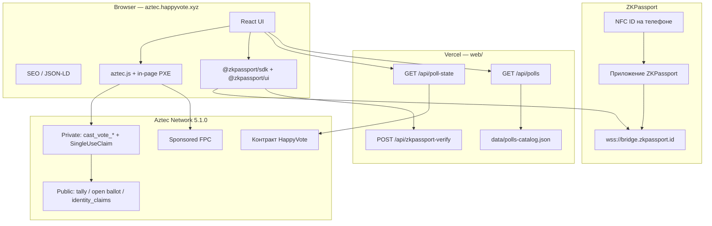
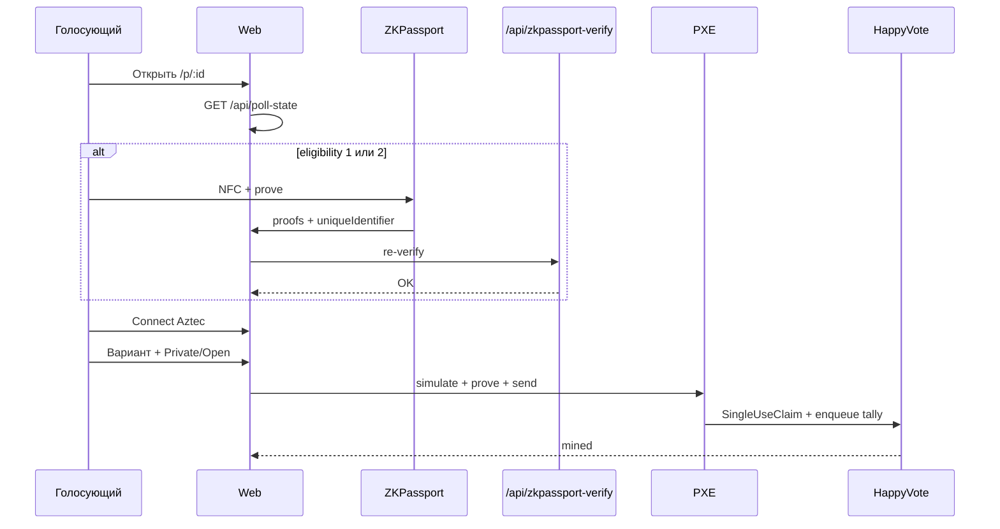

# 02 — Архитектура

Реализация — **один** контракт `HappyVote` (multi-poll maps), не отдельная factory. Off-chain каталог и гостевые чтения — на Vercel.

## 1. Высокий уровень



## 2. On-chain: `HappyVote` (`src/main.nr`)

Паттерн Aztec private voting: private function берёт nullifier, затем enqueue публичного обновления tally.

### 2.1 Storage

| Поле | Тип | Роль |
|------|-----|------|
| `admin` | `PublicMutable<AztecAddress>` | Контрактный admin: `create_poll` / `end_poll` |
| `options_count` | `Map<PollId, u32>` | 2…32; `0` = опроса нет |
| `privacy_policy` | `Map<PollId, u8>` | 0 / 1 / 2 |
| `eligibility_mode` | `Map<PollId, u8>` | 0 open / 1 personhood / 2 gated |
| `metadata_hash` | `Map<PollId, Field>` | Целостность off-chain JSON |
| `tally` | `Map<PollId, Map<Field, Field>>` | Голоса по вариантам |
| `total_votes` | `Map<PollId, Field>` | Число бюллетеней |
| `vote_ended` | `Map<PollId, bool>` | Закрыт |
| `active_at_block` | `Map<PollId, PublicImmutable<u32>>` | Блок создания |
| `vote_claims` | `Map<PollId, Owned<SingleUseClaim>>` | Один голос на аккаунт на опрос |
| `open_ballots` | `Map<PollId, Map<AztecAddress, Field>>` | `option_id + 1` (0 = нет) |
| `identity_claims` | `Map<PollId, Map<Field, bool>>` | Один ZKPassport UID на опрос |
| `sealed` | `Map<PollId, bool>` | Скрыть tallies до закрытия |

`PollId`: `{ id: Field }` в Noir, `{ id: Fr }` в TypeScript.

### 2.2 Внешние функции

| Метод | Видимость | Назначение |
|-------|-----------|------------|
| `constructor(admin)` | public initializer | Ненулевой admin контракта |
| `create_poll(...)` | public | Только контрактный admin (операторы итерации 1) |
| `cast_vote_private(...)` | private → enqueue public | Адрес скрыт; публичный tally++ |
| `cast_vote_open(...)` | private → enqueue public | Публичный бюллетень + tally++ |
| `end_poll(poll_id)` | public | Закрытие (контрактный admin) |
| `get_tally` / `get_total_votes` | view | `0` если sealed и не закрыт |
| Прочие view | view | Конфиг, open ballot, identity claim |

`identity_commitment`: `0` на open-опросах; иначе Field от ZKPassport `uniqueIdentifier`.

### 2.3 Поток голоса



### 2.4 Хеширование

В Aztec.nr — **Poseidon2**. `metadata_hash` каталога: SHA-256 → Field (`fromBufferReduce`).

### 2.5 Проверки

- `option_id` равен `option_id as u32 as Field` (отсечь truncation).
- Open eligibility запрещает ненулевой identity; personhood/gated требуют его и свободный claim.
- Private и open делят один домен `SingleUseClaim`.

## 3. Off-chain

### 3.1 Фронтенд (`web/`)

Vite + React. Маршруты:

| Путь | Страница |
|------|----------|
| `/` | Каталог + миссия |
| `/p/:id` | Голосование |
| `/legal/:slug` | Terms, Privacy, Data Safety, Cookies, GDPR |

Гостевые tallies только через same-origin `/api/poll-state`.

### 3.2 API

| Endpoint | Роль |
|----------|------|
| `GET /api/poll-state` | Гостевые публичные tallies (кэш) |
| `GET /api/polls` | Общий каталог опросов |
| `POST /api/zkpassport-verify` | Server re-verify `@zkpassport/sdk` |

### 3.3 Схема каталога

```json
{
  "id": "3",
  "title": "…",
  "description": "…",
  "options": [{ "label": "…", "description": "…" }],
  "eligibilityMode": 1,
  "privacyPolicy": 2,
  "sealed": false,
  "zkRequirements": {
    "personhood": true,
    "minAge": null,
    "nationalityIn": [],
    "nationalityOut": [],
    "sanctions": false,
    "facematchStrict": false,
    "policyId": null,
    "purpose": "Prove eligibility to vote on HappyVote on Aztec"
  }
}
```

## 4. Аккаунты и комиссии

| Среда | Аккаунты | Fees |
|-------|----------|------|
| Local network | Schnorr из скриптов | Бесплатно |
| Testnet | Browser session | Sponsored FPC |
| Alpha | Production | Fee Juice / FPC |

## 5. Структура репозитория

```
happy-vote-aztec/
├── AGENTS.md
├── Nargo.toml
├── src/main.nr
├── src/test/
├── scripts/
├── config/
├── web/
└── docs/                      # en/ + ru/
```

В монорепозитории HappyVote то же дерево лежит в `aztec/`, документация — `docs/aztec/`.

## 6. Границы доверия

| Данные | Доверие |
|--------|---------|
| Адрес private-бюллетеня | Клиент + ZK proof |
| Live tally варианта | Публичное состояние Aztec (если не sealed) |
| Атрибуты ZKPassport | Proof на устройстве; HappyVote не видит паспорт |
| Off-chain title/options | Каталог; `metadata_hash` on-chain |
| Ключи деплоя | Секрет оператора (gitignore `.env`) |
| Аналитика сайта | Нет стороннего счётчика; хост может логировать запросы |

## 7. Связь с EVM HappyVote

Отдельный поддомен и стек. Общий бренд и шаблон Happy/Sad. Нет общего ABI и миграции голосов.
