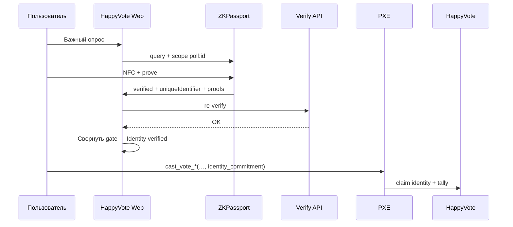

# 04 — ZKPassport

Официально: https://zkpassport.id/ · Docs: https://docs.zkpassport.id/  
Домен: `aztec.happyvote.xyz`

## 1. Зачем

Для важных опросов: человек vs бот; опционально возраст / гражданство / sanctions; **без** файлов паспорта на серверах HappyVote.

Поток: NFC ID → proof на телефоне → HappyVote получает результат предикатов + `uniqueIdentifier`.

Опросы с open-eligibility **не** используют ZKPassport. Там один голос на Aztec-аккаунт, поэтому новая Browser session может дать ещё один бюллетень.

## 2. Режимы

| Режим | Когда | Источник query |
|-------|-------|----------------|
| Self-served SDK | Правила на опрос | `@zkpassport/sdk` / `@zkpassport/ui` |
| Dashboard policy | Стабильный branded flow | [dashboard.zkpassport.id](https://dashboard.zkpassport.id) |

Production: SDK + QR, домен зарегистрирован, default policy `vote-identity-verification`.

Если задан `policyId`, query в виджете только `.policy(id)` — self-served предикаты из JSON каталога не уходят в ZKPassport. Фильтр стран на All polls всё равно нужен: при пустых `countries` / `nationalityIn` / `issuedBy` UI читает публичный Dashboard-проект `aztec.happyvote.xyz` и берёт `nationality` и `issuing_country` (`eq` / `in`).

## 3. Пример query

Personhood: `query={(q) => q.done()}`, `scope={poll:${pollId}}`.  
Gated: только нужные поля, например `q.gte("age", 18)`.

После `onResult` — `POST /api/zkpassport-verify`, затем hash `uniqueIdentifier`.

## 4. Связка с голосом



On-chain: `identity_commitment ≠ 0` для eligibility 1/2; `identity_claims` запрещает повтор.

## 5. Домен

Зарегистрировать `aztec.happyvote.xyz` в Dashboard. `uniqueIdentifier` привязан к домену. Не логировать proofs с PII.

## 6. Proofs

Server re-verify должен быть включён. Mock-паспорта — только для локальной разработки; на production нужны реальные ID.

## 7. Ограничения

Несколько ID у одного человека → «один ID ↔ один голос». FaceMatch на iOS использует Apple App Attest внутри приложения ZKPassport; ошибка DeviceCheck / key attestation — на стороне приложения и Apple, не HappyVote. Нужно приложение ZKPassport.

## 8. Когда требовать

Fun / Happy/Sad — open. Community — personhood желателен. Политические — personhood обязателен. Пользовательские (итерация 2) — выбор создателя.

## 9. Off-chain JSON требований

В каталоге; SHA-256 канонического JSON, reduction в Field → `metadata_hash` (в браузере digest сначала в Node `Buffer`, затем `fromBufferReduce`). `eligibility_mode`: `1` только personhood · `2` если есть age / nationality / sanctions / FaceMatch / `policyId`.

```json
{
  "personhood": true,
  "minAge": 18,
  "nationalityIn": ["USA", "DEU"],
  "nationalityOut": [],
  "sanctions": false,
  "facematchStrict": false,
  "policyId": null,
  "purpose": "Prove eligibility to vote on HappyVote on Aztec"
}
```

## 10. UI (2026-09-18)

QR — drop-in `@zkpassport/ui`, обёртка в стиле портала. `--zkp-bg` на карточке должен быть **непрозрачным**: виджет красит **Try again** этим цветом. Прозрачный `--zkp-bg` прятал подпись после неудачного скана. После успеха QR снимается, баннер **Identity verified**, детали по клику (включая предикаты Dashboard policy).

## 11. Чеклист

- [x] SDK + UI, домен, gate, `eligibility_mode` + `metadata_hash`
- [x] `/api/zkpassport-verify`, identity claim
- [x] Стилизация + сворачивание
- [x] Фильтр стран каталога из Dashboard policy
- [x] Noir: один identity, два аккаунта — fail
- [ ] E2E на устройстве
