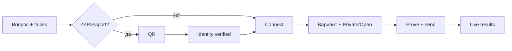

# 12 — UI / UX

Production: **https://aztec.happyvote.xyz**  
Бренд: **HappyVote on Aztec**

## Кратко

Лендинг объясняет *зачем* портал. Страница голосования той же ширины: бюллетень отдельно от live results.

## Главная (`/`)

Лендинг: бренд, миссия, pillars, **featured polls** (поле каталога `showOnHome`), блок доверия, подвал. Полный каталог — **All polls** (`/polls`) с поиском и фильтрами.

Шапка (десктоп и мобильный): логотип, короткие ссылки на десктопе, гамбургер-меню с Home / All polls, подключением кошелька или адресом, и местом под язык / тему позже.

Pillars: Private by design · Verified, not doxed · Safer where votes are risky.

## Все опросы (`/polls`)

Та же сетка карточек, что на главной, плюс поиск и фильтры. Нужна, когда опросов больше, чем короткий featured-список.

## Голосование (`/p/:id`)

Ширина **1080px**. Общая шапка сайта, ссылка **← All polls** на `/polls`, вопрос — `h1`. Две колонки на десктопе. Комиссии и how-to в `
`. Чипы Ready/Verify → Connect → Vote. На дневных опросах бейдж **Daily** и отсчёт до следующих суток UTC.

## ZKPassport

Обёртка в стиле портала. После успеха — баннер **Identity verified**. На мобильных Connect не перекрывает бюллетень огромным sticky-слоем.

## Ballot privacy

Зазор между заголовком **Ballot privacy** и кнопками Private / Open.

## Расписание

Карточки и страница опроса показывают **Upcoming / Live / Ended**, если заданы `startsAt` / `endsAt` (ISO в каталоге; страница голоса предпочитает on-chain unix-секунды). До старта — обратный отсчёт, Connect и Vote закрыты. После старта — отсчёт до конца. Без дат опрос открыт, пока его не закроют `end_poll` / `cancel_poll`. Пауза контракта тоже блокирует голос; вопрос остаётся читаемым.

## Legal

| Документ | Путь |
|----------|------|
| Terms of Service | `/legal/terms` |
| Privacy Policy | `/legal/privacy` |
| Data Safety | `/legal/data-safety` |
| Cookie Policy | `/legal/cookies` |
| GDPR | `/legal/gdpr` |

Дата: **15 August 2026**. Контакт: **legal@happyvote.xyz**. [13-LEGAL.md](./13-LEGAL.md).

## SEO

Title, description, canonical, OG, JSON-LD, `robots.txt`, `sitemap.xml` (включая `/polls`). Стороннего счётчика нет. Есть свои cookieless дневные агрегаты (`POST /api/site-stats`).
