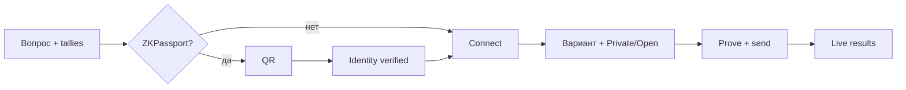

# 12 — UI / UX

Production: **https://aztec.happyvote.xyz**  
Бренд: **HappyVote on Aztec**

## Кратко

Лендинг объясняет *зачем* портал. Страница голосования той же ширины: бюллетень отдельно от live results.

## Главная (`/`)

Убрана бессмысленная **Browse polls**. Миссия → pillars → **Open polls** → блок доверия. В подвале автор (X / LinkedIn / GitHub) и legal.

Pillars: Private by design · Verified, not doxed · Safer where votes are risky.

## Голосование (`/p/:id`)

Ширина **1080px**. Компактная марка **HappyVote on Aztec**, вопрос — `h1`. Две колонки на десктопе. Комиссии и how-to в `
`. Чипы Ready/Verify → Connect → Vote.

## ZKPassport

Обёртка в стиле портала. После успеха — баннер **Identity verified**. На мобильных Connect не перекрывает бюллетень огромным sticky-слоем.

## Ballot privacy

Зазор между заголовком **Ballot privacy** и кнопками Private / Open.

## Расписание

Карточки и страница опроса показывают **Upcoming / Live / Ended**, если заданы `startsAt` / `endsAt` (ISO в каталоге; страница голоса предпочитает on-chain unix-секунды). До старта — обратный отсчёт, Connect и Vote закрыты. После старта — отсчёт до конца. Без дат опрос открыт, пока его не закроют `end_poll`.

## Legal

| Документ | Путь |
|----------|------|
| Terms of Service | `/legal/terms` |
| Privacy Policy | `/legal/privacy` |
| Data Safety | `/legal/data-safety` |
| Cookie Policy | `/legal/cookies` |
| GDPR | `/legal/gdpr` |

Дата: **13 August 2026**. Контакт: **legal@happyvote.xyz**. [13-LEGAL.md](./13-LEGAL.md).

## SEO

Title, description, canonical, OG, JSON-LD, `robots.txt`, `sitemap.xml`. Стороннего счётчика нет.
