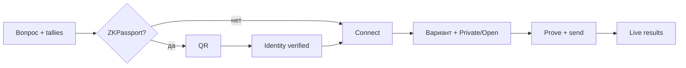

# 12 — UI / UX

Production: **https://aztec.happyvote.xyz**  
Бренд: **HappyVote on Aztec**

## Кратко

Лендинг объясняет *зачем* портал. Страница голосования той же ширины: бюллетень отдельно от live results.

## Главная (`/`)

Лендинг: бренд, миссия, pillars, **featured polls** (поле каталога `showOnHome`), блок доверия, подвал. Полный каталог — **All polls** (`/polls`) с поиском и фильтрами.

Шапка (десктоп и мобильный): логотип, короткие ссылки на десктопе, гамбургер-меню с Home / All polls, подключением кошелька или адресом, и местом под язык / тему позже.

Pillars: Private by design · Verified, not doxed · Safer where votes are risky.

## Все опросы (`/polls`)

Та же сетка карточек, что на главной, плюс поиск и фильтры (тема, страна, eligibility). Подходящие опросы разделены на **Active** и **Ended**.

**Ended** — у опроса в каталоге уже прошла `endsAt`. Без даты окончания опрос остаётся в **Active** (открыт, пока его не закроют через `end_poll` или `cancel_poll`). Ещё не начавшийся опрос тоже в **Active**. Поиск и фильтры действуют на обе группы. Карточка завершённого опроса открывается; Connect и Vote на странице остаются закрыты.

Список **стран** берёт ISO-коды из тегов каталога, self-served `nationalityIn` / `issuedBy` и — если у опроса есть Dashboard `policyId` — из `nationality` / `issuing_country` этой политики.

## Голосование (`/p/:id`)

Ширина **1080px**. Общая шапка сайта, ссылка **← All polls** на `/polls`, вопрос — `h1`. Две колонки на десктопе. Комиссии и how-to в `
`. Чипы Ready/Verify → Connect → Vote. На дневных опросах бейдж **Daily** и отсчёт до следующих суток UTC. Пока опрос **sealed** и открыт, на кнопках вариантов нет счётчиков и полосок; в шапке **Votes sealed**; Live results объясняют, что итоги скрыты до закрытия.

```mermaid
flowchart LR
  Guest[Вопрос + tallies] --> Gate{ZKPassport?}
  Gate -->|да| QR[QR]
  Gate -->|нет| Connect[Connect]
  QR --> Verified[Identity verified]
  Verified --> Connect
  Connect --> Ballot[Вариант + Private/Open]
  Ballot --> Prove[Prove + send]
  Prove --> Results[Live results]
```

Опросы только из overlay (не из клиентского seed) показывают **Loading poll…**, пока не придёт `GET /api/polls?id=`; tallies читаются уже с верным числом вариантов. ZKPassport-гейт подгружается после метаданных, чтобы шаринговая ссылка на телефоне не ждала Dashboard и QR.

На десктопе Connect предпочитает **Azguard** (Aztec 5.2.0, первая кнопка в модалке). **Browser session** — способ проголосовать во вкладке (initializerless, новый адрес на подключение). **Web Wallet** — Demo Wallet Labs: подключение возможно, prove бюллетеня пока нет. На iPhone модалка выбирает Browser session. Кнопка показывает **Preparing wallet…** только пока адрес регистрируется первый раз; следующие опросы сразу **Vote privately** / **Vote openly**. Пока идёт шаг (**Checking identity…**, **Preparing fee…**, **Proving ballot…**, **Waiting for block…**, **Updating results…**, **Preparing wallet…**), кнопка остаётся яркой, а три точки в подписи по очереди подпрыгивают. Описание шага, плашка успеха и ошибка стоят сразу под кнопкой, выше заметок про privacy и дневной лимит. **Open tx** — на этой плашке. Prove голоса по-прежнему может быть долгим. После смены разрешений Azguard — отключиться и подключиться снова. Если с этого браузера уже голосовали, UI показывает локальную подсказку (без адреса) и **не** блокирует Vote: повтор с тем же аккаунтом упадёт ончейн.

## ZKPassport

Обёртка в стиле портала. После неудачного скана **Try again** остаётся читаемым. После успеха — баннер **Identity verified**. На мобильных Connect не перекрывает бюллетень огромным sticky-слоем.

## Ballot privacy

Зазор между заголовком **Ballot privacy** и кнопками Private / Open.

## Расписание

Карточки и страница опроса показывают **Upcoming / Live / Ended**, если заданы `startsAt` / `endsAt` (ISO в каталоге; страница голоса предпочитает on-chain unix-секунды). До старта — обратный отсчёт, Connect и Vote закрыты. После старта — отсчёт до конца. Без дат опрос открыт, пока его не закроют `end_poll` / `cancel_poll`. Пауза контракта тоже блокирует голос; вопрос остаётся читаемым.

## Legal

| Документ | Путь |
|----------|------|
| Terms of Service | `/legal/terms` |
| Privacy Policy | `/legal/privacy` |
| Data Safety | `/legal/data-safety` |
| Cookie Policy | `/legal/cookies` |
| GDPR | `/legal/gdpr` |

Дата: **15 August 2026**. Контакт: **legal@happyvote.xyz**. [13-LEGAL.md](./13-LEGAL.md).

## SEO

Title, description, canonical, OG, JSON-LD, `robots.txt`, `sitemap.xml` (включая `/polls` и `/p/1`–`/p/5`). Стороннего счётчика нет. Есть свои cookieless дневные агрегаты (`POST /api/site-stats`).
